# ΛXÖN — Autonomous Web Navigation Agent

### DAG-Orchestrated Browser Automation with Cost-Optimized Cascade

> *ΛXÖN is a multi-skill agent built on a DAG orchestrator. It decomposes complex queries into parallel skill nodes — researcher, retriever, distiller, summariser, critic, formatter, coder, comparator, screener, fact_checker — all powered by MCP tools. The **browser** skill adds live web navigation: opening a real Chromium instance, reading the page structure, and deciding what to click, type, or filter — autonomously.*

[](https://python.org)
[](https://playwright.dev/python/)
[](https://networkx.org)

---

## Overview

ΛXÖN's planner routes queries to the appropriate skill. When a task requires interacting with a live website — filling forms, clicking filters, extracting dynamic content — it routes to the browser skill instead of the researcher.

The orchestrator handles everything else: NetworkX DAG construction, parallel execution via asyncio, typed edges between nodes, FastAPI + WebSocket dashboard for live observability, and atomic session persistence for replay.

---

## Architecture

```
╔══════════════════════════════════════════════════════════════════════════════════════════╗
║                                    ΛXÖN                                                  ║
╠══════════════════════════════════════════════════════════════════════════════════════════╣
║                                                                                          ║
║   ┌─────────────┐         ┌────────────────────────────────────────────────────────┐     ║
║   │  Dashboard  │◄━━━━━━━━┤  WebSocket Event Stream (actions, tokens, screenshots) │     ║
║   │  :8080      │         └───────────────────────────┬────────────────────────────┘     ║
║   └─────────────┘                                     │                                  ║
║                                                       │ on_event()                       ║
║   ┌─────────────────────────────────────────────────────────────────────────────────┐    ║
║   │                           DAG ORCHESTRATOR (flow.py)                            │    ║
║   │                                                                                 │    ║
║   │    User Query ──▶ ┌─────────┐ ──▶ NetworkX DAG ──▶ Parallel Executor            │    ║
║   │                   │ PLANNER │     (typed edges)     (asyncio.gather)            │    ║
║   │                   └─────────┘                                                   │    ║
║   │                        │                                                        │    ║
║   │    ┌──────────┬──────────┬───┼───┬──────────┬───────────┬──────────┐            │    ║
║   │    ▼          ▼          ▼       ▼          ▼           ▼          ▼            │    ║
║   │ ┌────────┐┌─────────┐┌───────┐┌──────┐┌─────────┐┌──────────┐┌─────────┐        │    ║
║   │ │research││critic   ││browser││coder ││distiller││comparator││formatter│        │    ║
║   │ │ (MCP)  ││         ││(NEW)  ││(exec)││(reduce) ││ (merge)  ││(output) │        │    ║
║   │ └────────┘└─────────┘└───┬───┘└──────┘└─────────┘└──────────┘└─────────┘        │    ║
║   │                           │    + summariser, critic, fact_checker               │    ║
║   │                           │                                                     │    ║
║   └───────────────────────────┼─────────────────────────────────────────────────────┘    ║
║                               │                                                          ║
║   ┌───────────────────────────▼──────────────────────────────────────────────────────┐   ║
║   │                     BROWSER SKILL — 4-LAYER CASCADE                              │   ║
║   │                                                                                  │   ║
║   │   ┌──────────────────────────────────────────────────────────────────────────┐   │   ║
║   │   │ LAYER 1: Static Extraction (Cheapest)                                    │   │   ║
║   │   │ ──▶ HTTP GET (httpx) + Trafilatura text extraction                       │   │   ║
║   │   │ ──▶ LLM Validation ("Does this answer the goal?")                        │   │   ║
║   │   └───────────────────────────────┬──────────────────────────────────────────┘   │   ║
║   │                          [Yes] ──▶ DONE (~200 tokens)                            │   ║
║   │                          [No / SPA]                                              │   ║
║   │                                   │                                              │   ║
║   │   ┌───────────────────────────────▼──────────────────────────────────────────┐   │   ║
║   │   │ LAYER 2: CSS Selectors (Deterministic)                                   │   │   ║
║   │   │ ──▶ Pre-written site maps & IDs                                          │   │   ║
║   │   │ ──▶ Zero LLM cost                                                        │   │   ║
║   │   └───────────────────────────────┬──────────────────────────────────────────┘   │   ║
║   │                          [Yes] ──▶ DONE (0 LLM cost)                             │   ║
║   │                          [No / No selectors]                                     │   ║
║   │                                   │                                              │   ║
║   │   ┌───────────────────────────────▼──────────────────────────────────────────┐   │   ║
║   │   │ LAYER 3: A11y Interaction Loop (The Workhorse)                           │   │   ║
║   │   │ ──▶ Playwright + 2-Pass Element Scan (ARIA roles + cursor:pointer)       │   │   ║
║   │   │ ──▶ Outermost-wins dedup (preserves gridcell, slider, form controls)     │   │   ║
║   │   │ ──▶ Compact numbered list (40-130 items) sent to LLM                     │   │   ║
║   │   │ ──▶ LLM returns structured JSON {"thought", "actions"}                   │   │   ║
║   │   │ ──▶ Execute via Playwright (click by DOM index) ──┐                      │   │   ║
║   │   │      ▲                                            │                      │   │   ║
║   │   │      └────────────────────────────────────────────┘ (3-8 turns)          │   │   ║
║   │   └───────────────────────────────┬──────────────────────────────────────────┘   │   ║
║   │                          [Done] ──▶ DONE (8-30K tokens total)                    │   ║
║   │                          [Element not in list]                                   │   ║
║   │                                   │                                              │   ║
║   │   ┌───────────────────────────────▼──────────────────────────────────────────┐   │   ║
║   │   │ LAYER 4: Vision (On-Demand / One-Shot)                                   │   │   ║
║   │   │ ──▶ Capture Playwright screenshot                                        │   │   ║
║   │   │ ──▶ Annotate with Set-of-Marks (numbered dashed boxes)                   │   │   ║
║   │   │ ──▶ Send to VLM — one action — return to Layer 3 loop                    │   │   ║
║   │   └──────────────────────────────────────────────────────────────────────────┘   │   ║
║   │                                                                                  │   ║
║   └──────────────────────────────────────────────────────────────────────────────────┘   ║
║                                                                                          ║
║   ┌──────────────────────────────────────────────────────────────────────────────────┐   ║
║   │  INFRASTRUCTURE                                                                  │   ║
║   │  Playwright + Stealth │ LLM Gateway │ Persistence (FS) │ JSONL Tracing           │   ║
║   └──────────────────────────────────────────────────────────────────────────────────┘   ║
╚══════════════════════════════════════════════════════════════════════════════════════════╝
```

<details>
<summary><b>Mermaid Diagram</b> (click to expand — renders on GitHub)</summary>

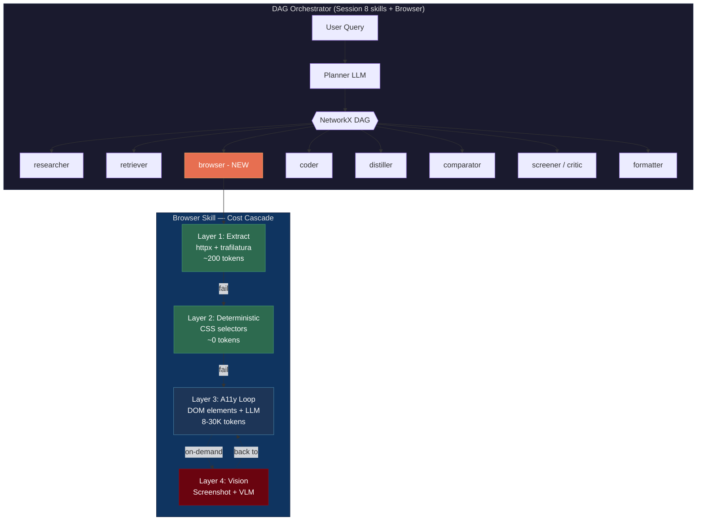

</details>

---

## What We Send to the LLM (Cost Control)

A typical webpage has 500-2000 DOM nodes. Sending all of that would mean 15-20K tokens of noise per turn. Instead, the browser skill sends only what the LLM needs to make a decision:

**Sent each turn:**
- Numbered interactive elements only (40-130 items)
- Prior actions (last 10) — so the LLM doesn't repeat itself
- Page content text (after turn 2, max 4000 chars) — for extraction

**Not sent:**
- Raw HTML, CSS classes, style attributes
- Non-interactive divs, spans, SVG internals
- Hidden elements, duplicates, decorative wrappers

**Example — what one LLM turn actually looks like:**

```
You are a browser automation agent.

Goal: Find cheapest flights from Bangalore to Delhi next weekend on https://www.cleartrip.com

Interactive elements (click by #number):
  #1 link "Flights"
  #2 link "Hotels"
  #3 link "Trains"
  #4 input "Where from?"
  #5 input "Where to?"
  #6 button "Search flights"
  #7 link "Offers"
  #8 slider "Price" (current=0) [use set_range with real target amount e.g. 35000]

Prior actions (last 10):
  Clicked #1: "Flights"

Respond ONLY as a JSON object with "thought" and "actions":
{"thought": "brief reason", "actions": [{"action": "click", "element": 4}, {"action": "type", "element": 4, "text": "BLR"}]}
```

**LLM responds:**
```json
{"thought": "Need to enter departure city", "actions": [{"action": "click", "element": 4}, {"action": "type", "element": 4, "text": "BLR"}]}
```

The LLM's job is narrow: given these clickable things, which one do I click next? Pick a number. No HTML parsing, no layout understanding — just a selection from a numbered menu.

**Key difference from reference implementation:** The reference code never sends page content — the LLM navigates blind and guesses when to stop, then a separate distiller re-fetches the page for extraction. We inject 4000 chars of page text after turn 2. The LLM sees actual data (flight prices, paper titles, listing details), knows exactly when to stop, and extracts in the same pass. Costs ~1-2K extra tokens per turn but saves 2-3 unnecessary turns. The downstream nodes (comparator, formatter) still run for cross-site merging and structured output — but they work with already-extracted data, not raw pages.

---

## Element Detection

Two-pass approach (inspired by [browser-use](https://github.com/browser-use/browser-use)):

**Pass 1 — Targeted selectors:** Standard HTML interactive tags + ARIA roles (`gridcell`, `combobox`, `option`, `menuitem`, `slider`, `tab`) + `tabindex` + `onclick`.

**Pass 2 — Cursor:pointer scan:** Catches React/Vue/Angular components that use click handlers without semantic HTML. Skips SVG internals.

**Dedup (outermost-wins):** If a parent and child are both clickable with the same text, keep only the parent. Preserves: calendar cells (`role=gridcell`), form controls, sliders, elements with distinct text.

**Name resolution (10-step fallback):** `aria-label` → `aria-labelledby` → `innerText` → `value` → `placeholder` → `title` → `alt` → `data-tooltip` → `data-testid` → `name`

---

## The Interaction Loop

Each turn of the Layer 3 loop:

1. Dismiss overlays (cookie banners, login modals, popups)
2. Detect Cloudflare challenges — wait for auto-resolution
3. Extract interactive elements (two-pass detection)
4. Build compact element list
5. Send to LLM → structured JSON response: `{"thought": "...", "actions": [...]}`
6. Execute actions via Playwright (click by DOM index, not coordinates)
7. Auto-select first autocomplete suggestion (non-search fields)

**Actions:** `click`, `type`, `press`, `scroll`, `set_range`, `drag`, `go_back`, `done`

**Slider handling:** `set_range` focuses the handle, presses Home to reset, then ArrowRight in batches — reading the displayed value after each batch until target reached. Works on any ARIA-compliant slider.

---

## Setup

### Prerequisites

- Python 3.11+
- AWS credentials configured via `aws login`
- Chromium (installed via Playwright)

### Installation

```bash
git clone https://github.com/Shwethaamrutha/EAGv3-Session9.git
cd EAGv3-Session9
pip install -e .
playwright install chromium
```

### Configuration

```bash
cp .env.example .env
# Configure API keys and region
```

### Running

```bash
python dashboard_server.py
# Open http://localhost:8080
```

---

## Dashboard

Same dashboard from Session 8, extended with browser-specific tabs:

| Tab | Description |
|-----|-------------|
| **Live Trace** | Real-time execution log — per-turn actions, thoughts, element clicks |
| **Execution Graph** | DAG visualization — same as Session 8, browser nodes highlighted |
| **Answer** | Final rendered output (markdown tables, structured data) |
| **Browser Replay** | Session report — goal, path chosen, actions, screenshots, metrics |
| **Browser I/O** | Per-turn debugging — element list sent, LLM response, tokens |
| **Node I/O** | Orchestrator-level input/output per skill node |

---

## Demo Queries

### Hacker News — Static Extraction (Layer 1)

```
Find the top 5 stories on https://news.ycombinator.com/
```

| 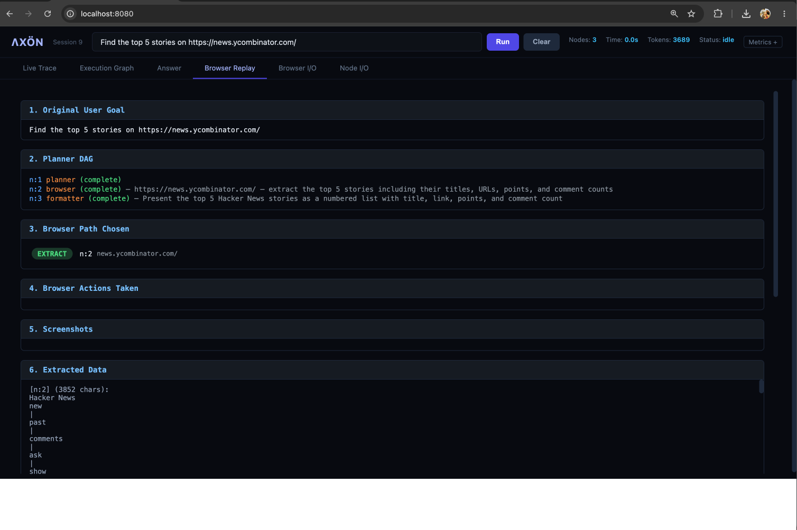 | 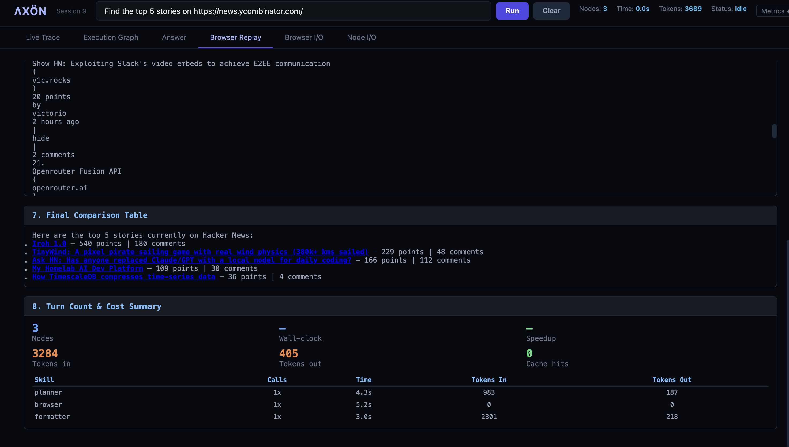 |
|:---:|:---:|

---

### GitHub Trending — Python Repositories

```
Find trending Python repositories this week on https://github.com/
```

| 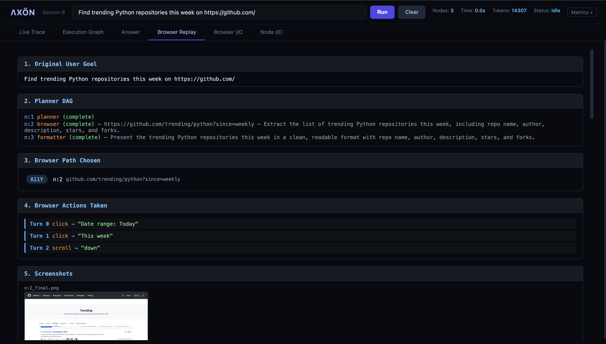 | 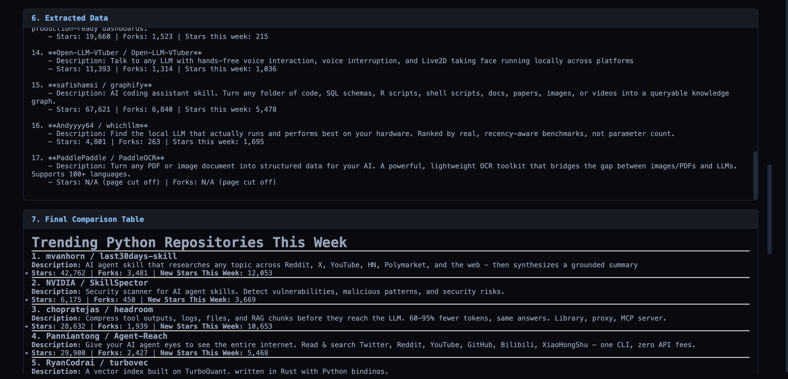 |
|:---:|:---:|
| 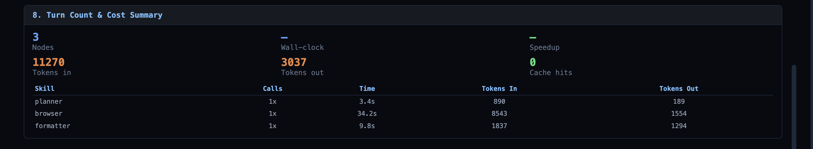 | 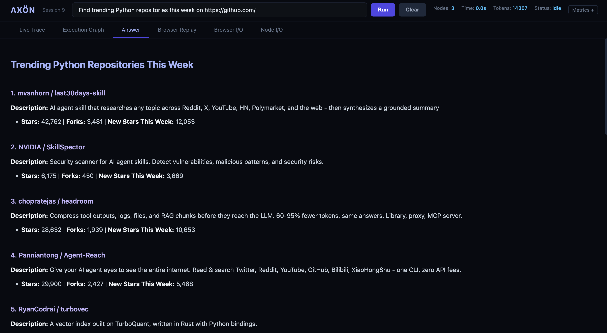 |

---

### Google Scholar — Browser Agent Papers

```
Find recent papers about browser agents published in 2026 on https://scholar.google.com
```

| 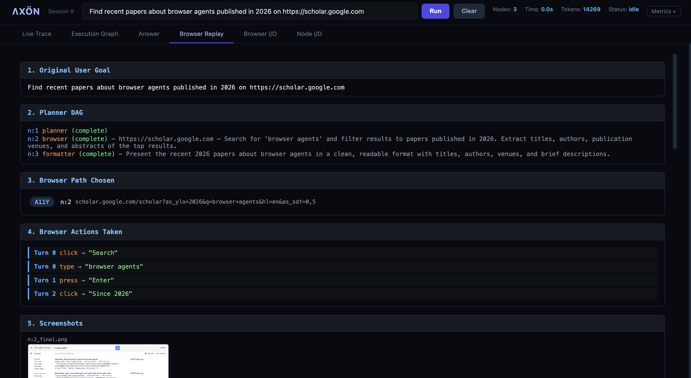 | 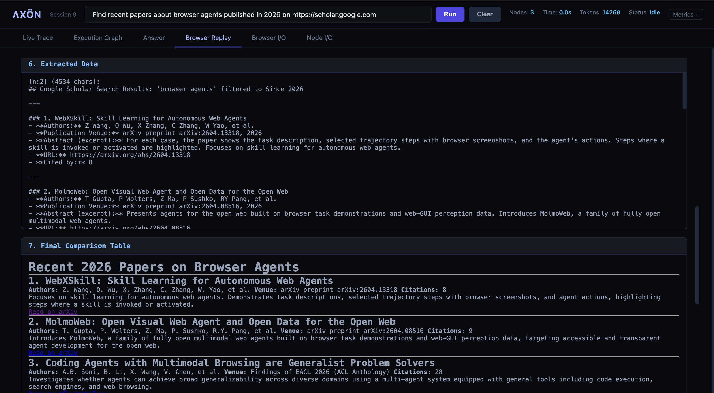 |
|:---:|:---:|
| 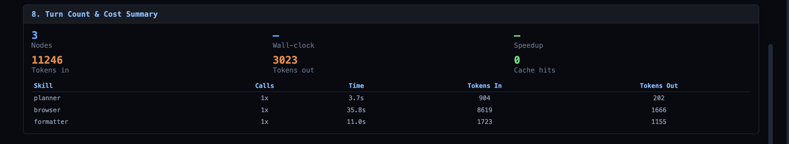 | 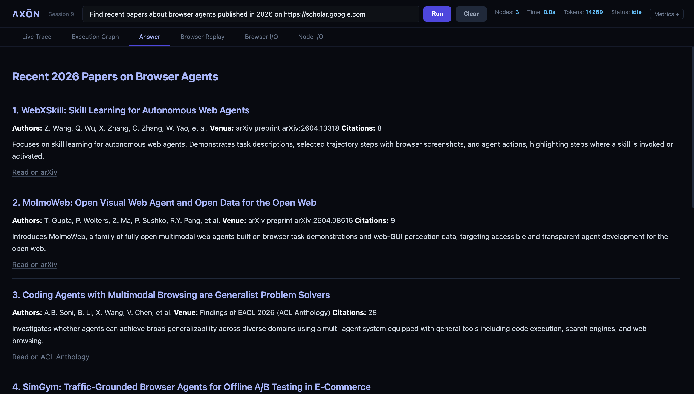 |

---

### Cleartrip Flights — Complex Form Interaction

```
Find cheapest flights from Bangalore to Delhi next weekend on https://www.cleartrip.com
```

| 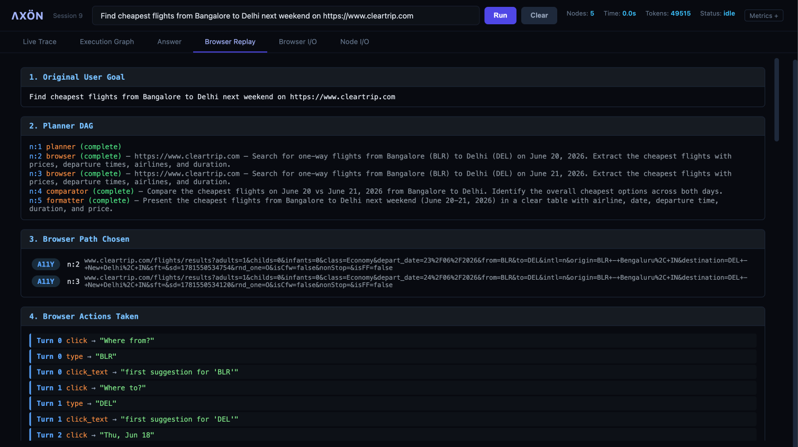 | 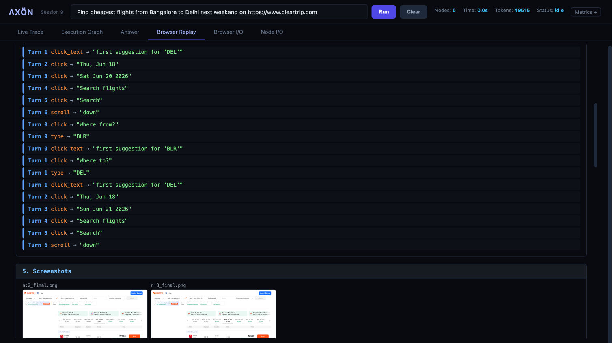 |
|:---:|:---:|
| 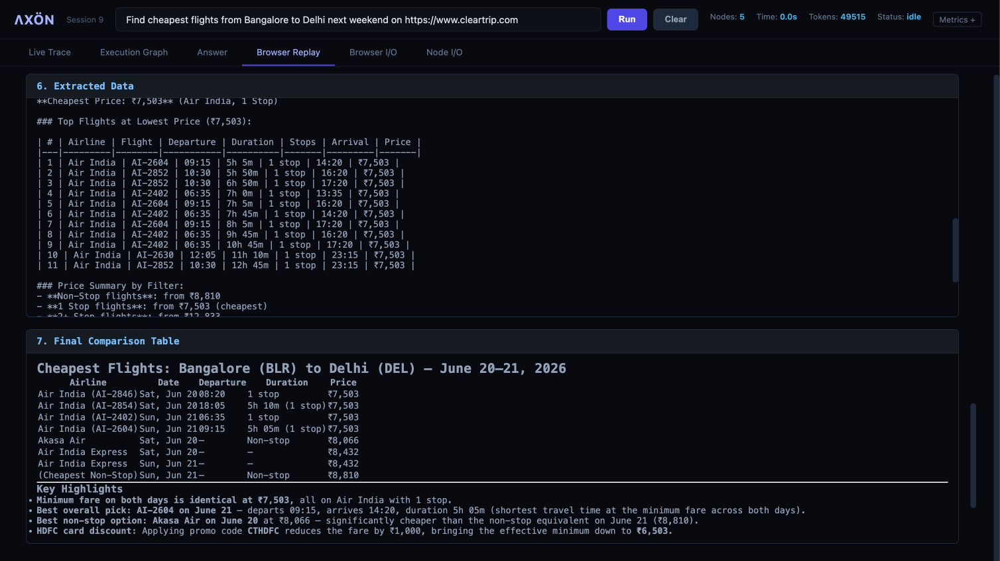 | 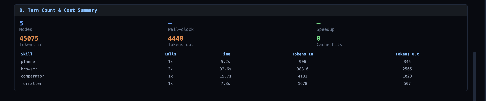 |
| 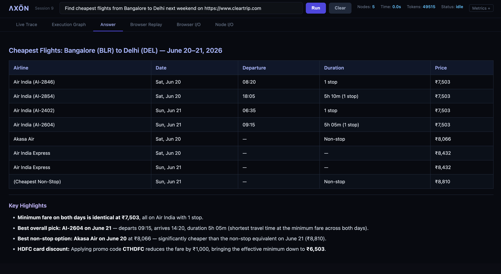 | |

---

### NoBroker Rentals — Filters + Slider

```
Find 2BHK flats for rent under 35000 in Koramangala on https://www.nobroker.in
```

| 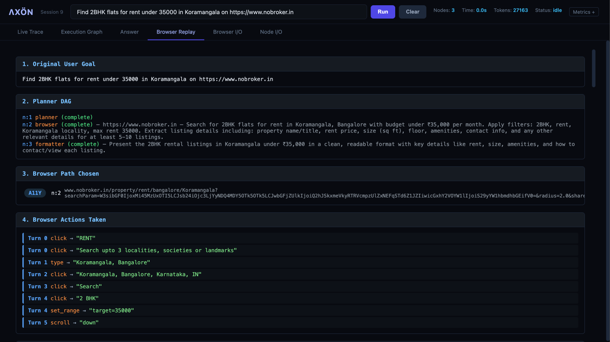 | 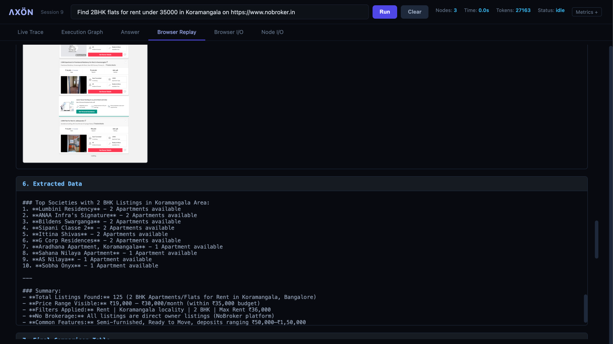 |
|:---:|:---:|
| 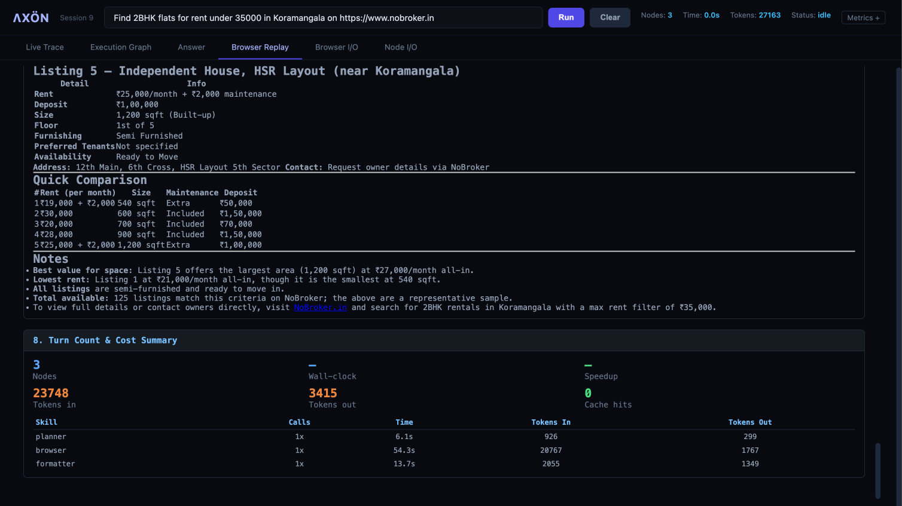 | |

---

## Project Structure

```
.
├── browser/                 # Browser skill package (NEW)
│   ├── skill.py             # Cascade orchestrator + interaction loop
│   ├── driver.py            # Playwright lifecycle, stealth, overlay dismissal
│   ├── dom.py               # Element detection (2-pass + dedup)
│   ├── extract.py           # Layer 1: static extraction (httpx + trafilatura)
│   ├── highlight.py         # Set-of-marks annotation for vision layer
│   ├── precondition.py      # Gateway block detection
│   └── selectors.py         # Layer 2: site-specific CSS selectors
├── core/                    # Infrastructure modules
│   ├── cache.py             # LLM response caching
│   ├── persistence.py       # Atomic session state persistence
│   ├── recovery.py          # Failure classification + re-planning
│   ├── replay.py            # Session replay logic
│   ├── report.py            # Session report generator
│   ├── sandbox.py           # Code execution sandbox
│   ├── schemas_v2.py        # Typed contracts (AgentResult, NodeSpec, RunBudget)
│   └── tracing.py           # Per-node span logging
├── agent/                   # LLM gateway
│   ├── config.py            # Settings (profile, region)
│   └── llm_gateway/         # Bedrock client with credential refresh
├── prompts/                 # Skill prompt templates
├── S9-Screenshots/          # Demo screenshots
├── flow.py                  # DAG orchestrator (entry point)
├── dashboard_server.py      # FastAPI + WebSocket server (entry point)
├── dashboard_s8.html        # Single-page dashboard UI
├── skills.py                # Skill catalogue loader
├── mcp_server.py            # MCP tools (web_search, fetch_url, run_command)
├── mcp_runner.py            # Tool-use loop
├── agent_config.yaml        # 11 skills including browser
├── pyproject.toml           # Dependencies
└── .env.example             # Configuration template
```

---

## Design Decisions

| Decision | Why |
|----------|-----|
| Cascade over direct browser | Don't burn 25K tokens when a GET request works |
| Element list over full HTML | 40-130 items vs 2000 DOM nodes — keeps each turn at 3-4K tokens |
| Page content after turn 2 | LLM knows when to stop + extracts in same pass (no separate distiller) |
| DOM index over coordinates | Viewport-independent clicks, no coordinate drift |
| Auto-click suggestions | Saves a turn on every autocomplete field |
| Keyboard for sliders | Only universal method — ARIA spec mandates arrow key support |
| Playwright-stealth | Cloudflare/bot detection bypass without custom proxies |
| Structured JSON response | Clean parsing, turn-by-turn debugging in Browser I/O |
| Per-turn JSONL persistence | Full replay without re-running the query |
| Scroll to content area | Moves mouse to 65% viewport width before wheel — prevents sidebar scroll |

---

## Known Limitations

- **Cloudflare Turnstile**: "Press and hold" verification blocks all automated browsers. Agent reports `gateway_blocked`.
- **Non-linear sliders**: Incremental keyboard approach works but takes 5-10 seconds for calibration.
- **Non-determinism**: Temperature 0 doesn't guarantee identical outputs. Complex forms may need 1-2 retries.
- **Heavy SPAs**: Pages with 200+ interactive elements slow down element detection (~2s).

---

## References

- [browser-use](https://github.com/browser-use/browser-use) — Element detection patterns
- [Playwright](https://playwright.dev/python/) — Browser automation
- [Set-of-Marks (Yang et al. 2023)](https://arxiv.org/abs/2310.11441) — Visual element annotation
- [Playwright Stealth](https://pypi.org/project/playwright-stealth/) — Anti-detection patches
